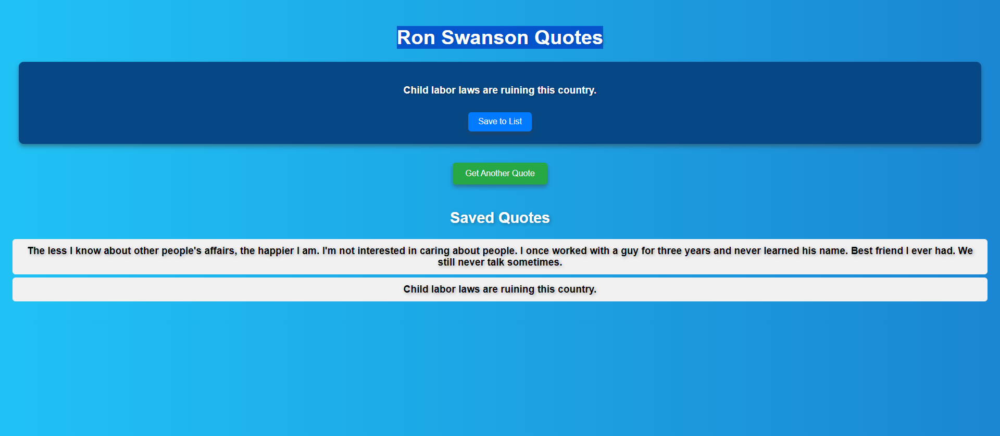

# Ron Swanson Quotes App
This project is a simple React app that displays random quotes from Ron Swanson Quotes API. Users can view random quotes, save their favorite ones to a list, and see all their saved quotes.

## Features:

. Fetch and display random Ron Swanson quotes from an external API.
. Save favorite quotes to a personal list.
. Stylish card layout with responsive design.
. Deployed on Vercel for easy access.

### Project Overview

This project demonstrates a simple implementation of a React app that uses external API calls to display quotes and allows users to save their favorite quotes. The app is built with React and styled for a clean and modern look.

### Technologies Used
React: A JavaScript library for building user interfaces.
CSS (or styled-components): For styling components.
Axios: To make HTTP requests to the Ron Swanson Quotes API.

### screenshot

